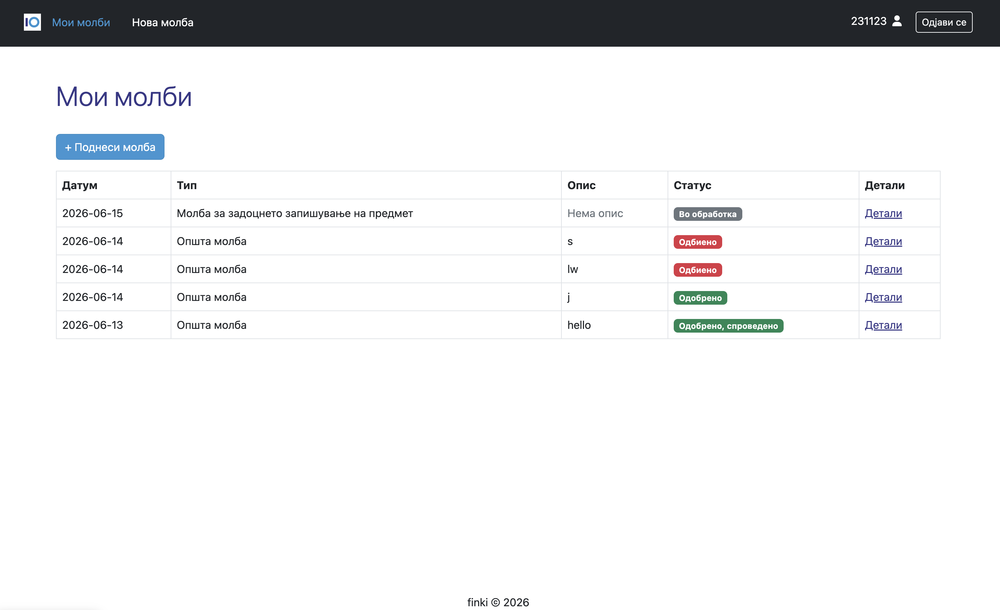
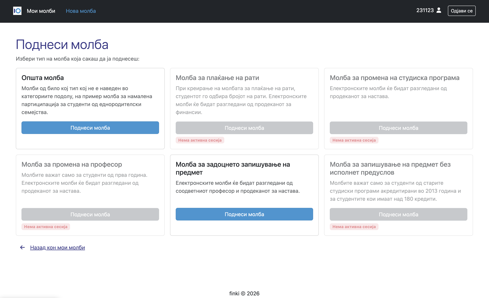
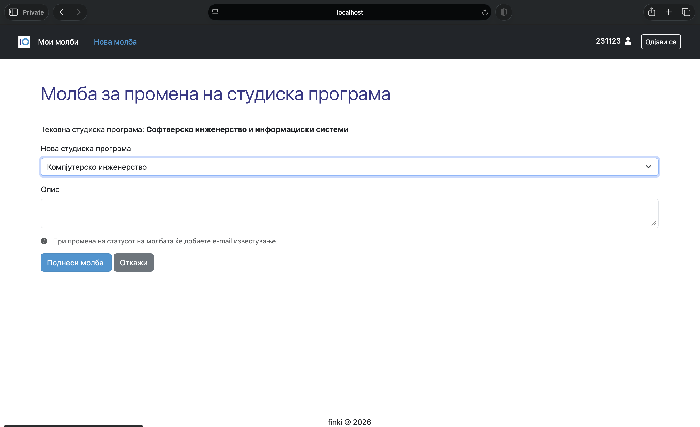
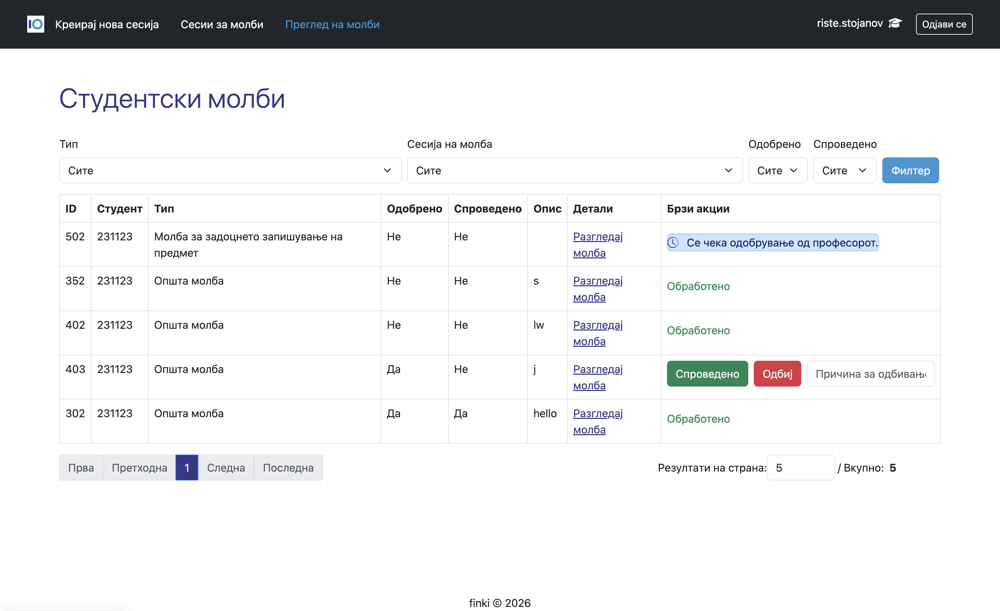
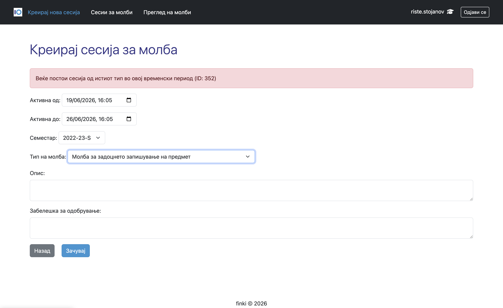
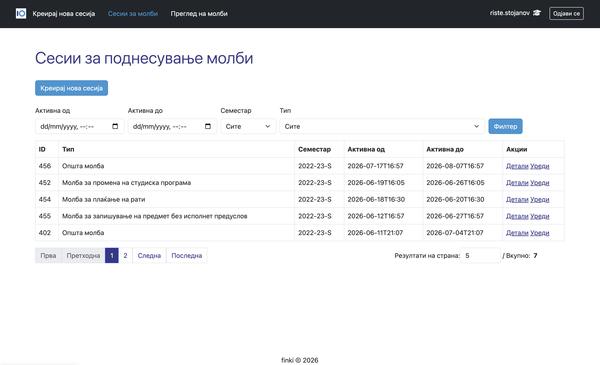
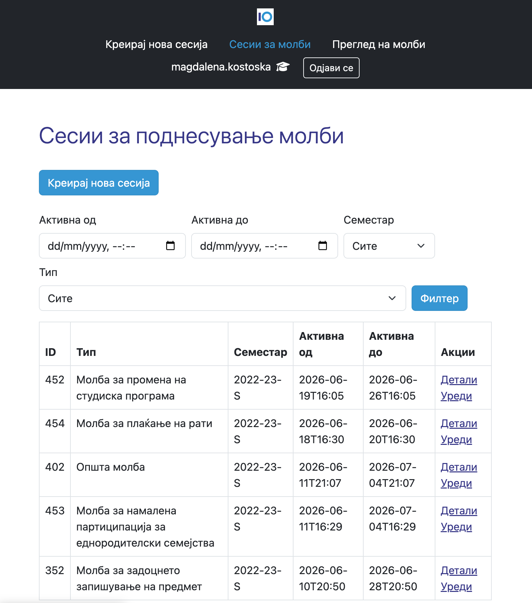
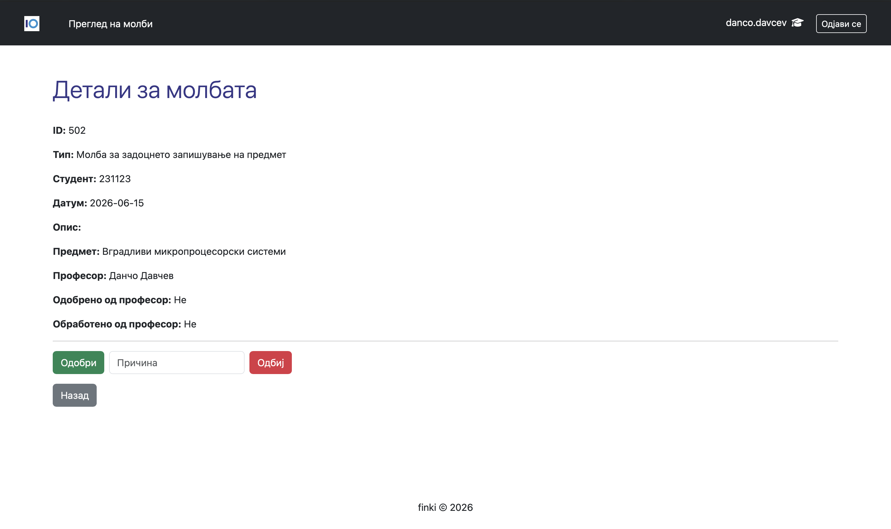
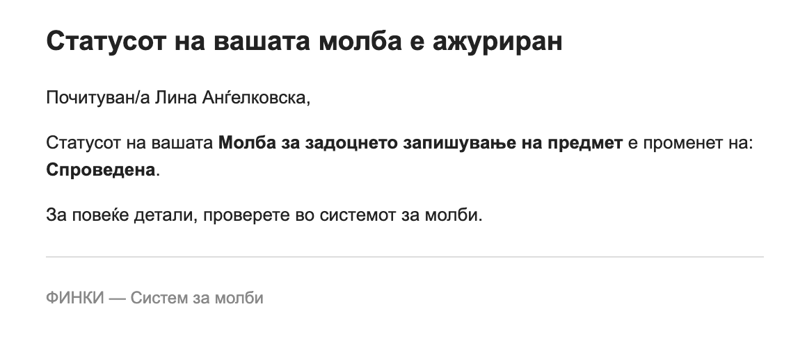

#  Student Requests Management System

> A role-based web application for managing academic and administrative student requests with multi-step approval workflows, built with Spring Boot.

---

##  Overview

This system simulates a real university request management process where students submit various types of requests that are processed by different faculty roles such as professors and deans.

It supports **role-based approvals**, **dynamic filtering**, **pagination**, and **event-driven email notifications with async processing**.

---

##  Key Features

- Submit multiple types of student requests
- Role-based approval workflow (Professor, Dean of Studies, Dean of Finance)
- Multi-step request processing pipeline
- Advanced filtering (type, status, session)
- Pagination support for large datasets
- Email notifications on status changes
- Asynchronous event-driven processing (`@Async + Spring Events`)
- Detailed request views per request type
- Rejection with mandatory reason tracking

---

##  Architecture

The project follows a layered architecture:

- **Presentation Layer** – Spring MVC + Thymeleaf
- **Service Layer** – Business logic and workflows
- **Repository Layer** – Spring Data JPA
- **Domain Layer** – Entities and enums
- **Infrastructure Layer** – Email, configuration, events

###  Design Patterns Used:

- Repository Pattern
- Specification Pattern (dynamic filtering)
- Observer Pattern (Spring Events)
- Layered architecture separation of concerns

---

##  Workflow

1. Student submits a request
2. Request is assigned to the appropriate faculty role
3. Professor reviews academic requests (if applicable)
4. Dean of Studies / Dean of Finance reviews based on request type
5. Final decision is recorded (approved / rejected / processed)
6. Student receives email notification asynchronously

---

##  User Roles

| Role             | Responsibilities |
|------------------|------------------|
|  Student        | Submit and track requests |
|  Professor     | Approves academic requests (e.g. late enrollment) |
|  Dean Finance  | Handles financial-related requests |
|  Dean Studies  | Oversees academic policies |


---

##  Email Notification System

The system automatically sends email notifications when a request status changes.

### Trigger events:
- Request approved
- Request rejected
- Request processed

### Implementation:
- Spring Events (`ApplicationEvent`)
- Asynchronous processing (`@Async`)
- Thymeleaf email templates

---

##  Tech Stack

- Java 17+
- Spring Boot
- Spring MVC
- Spring Security
- Spring Data JPA (Hibernate)
- Thymeleaf
- Bootstrap 5
- PostgreSQL / MySQL
- Maven

---

##  Setup & Run

### 1. Clone repository
```bash
git clone https://github.com/linaan0/student-requests-system.git
```
### 2. Configure environment variables

Create a `.env` file or set system environment variables:

```bash
DB_URL=jdbc:postgresql://localhost:54322/finki-services-db
DB_USERNAME=your_username
DB_PASSWORD=your_password

MAIL_USERNAME=your_email@gmail.com
MAIL_PASSWORD=your_app_password
```
### 3. Configure application.properties
```bash
spring.datasource.url=${DB_URL}
spring.datasource.username=${DB_USERNAME}
spring.datasource.password=${DB_PASSWORD}

spring.jpa.hibernate.ddl-auto=update
spring.jpa.show-sql=true

spring.mail.host=smtp.gmail.com
spring.mail.port=587
spring.mail.username=${MAIL_USERNAME}
spring.mail.password=${MAIL_PASSWORD}
spring.mail.properties.mail.smtp.auth=true
spring.mail.properties.mail.smtp.starttls.enable=true
```

### 4. Run the application
```bash
   mvn spring-boot:run
```
### 5. Access the app
```bash
   http://localhost:8080
```

## Screenshots

### Student View
Overview of submitted requests.



Request type selection.



New request.




### Academic Affairs Vice Dean View
Overview of submitted requests awaiting review.



Creating a new request session with validation error messages.



Request sessions management.



### Finance Vice Dean View
Mobile view of the request dashboard.



### Professor View
Detailed page for handling late course enrollment requests.



### Email Notifications
Email sent when a request status changes.


